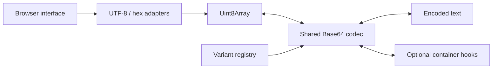

# Base64 family codec

A small, dependency-free encoder and decoder for Base64, Base64URL, MIME Base64, and PEM Base64. All conversions run locally in the browser. No network requests carry input, and input is not persisted.

Target deployment: <https://kicey.github.io/base64-family-codec/>.

## Development

Use Node.js 22 or newer. No installation step is required.

| Command | Effect |
| --- | --- |
| `npm run dev` | Starts a loopback-only development server at `http://127.0.0.1:4173/base64-family-codec/`. |
| `npm test` | Runs Node's built-in test runner, including RFC vectors, binary round trips, and validation cases. |
| `npm run check` | Checks application JavaScript syntax without running it. |
| `npm run build` | Replaces the generated `dist/` directory with public application files and adds `.nojekyll`. |
| `npm run preview` | Serves `dist/` at the same repository subpath. Run the build first. |

The development server deliberately serves the repository subpath, so local testing exercises the same relative asset URLs used by GitHub Pages. `PORT` optionally changes the default port. No client-side router or absolute asset paths are required.

## Interface

Choose a variant and an operation, then enter UTF-8 text, hexadecimal byte pairs, or encoded data. Automatic conversion can be disabled; the action button and Cmd/Ctrl+Enter always convert immediately. **Use as input** transfers the result and reverses the operation. Copying uses the original output, preserving MIME CRLF line endings even though textarea display normalizes them.

When decoded text contains carriage returns, **Use as input** switches to hex so textarea newline normalization cannot change the bytes. Use hex from the start when original text line endings must be preserved exactly.

Hex mode supports arbitrary binary data. UTF-8 decoding rejects malformed sequences instead of silently replacing bytes. The interface limits input to 2,000,000 characters per conversion to keep synchronous work bounded; the library does not impose this limit.

## Variant policies

| Variant | Last two symbols | Encoding padding | Wrapping | Decoding |
| --- | --- | --- | --- | --- |
| Base64 | `+/` | Required | None | Strict alphabet, padding, and zero unused bits |
| Base64URL | `-_` | Off by default; selectable | None | Accepts padded and unpadded input; otherwise strict |
| MIME | `+/` | Required | 76 characters, CRLF | Ignores non-alphabet characters; validates padding |
| PEM | `+/` | Required | 64 characters, LF | Accepts ASCII whitespace and one optional matching envelope; validates padding |

The core always preserves input bytes. MIME is a transfer-encoding codec, not an email composer: it does not normalize text newlines or add MIME headers. Callers composing MIME `text/*` bodies must canonicalize text line endings separately.

PEM defaults to a wrapped Base64 payload. Enable **PEM boundaries** to add BEGIN/END lines with a label. `DATA` is a generic demonstration label, not a standardized key or certificate type. Adding a label does not create or validate an ASN.1 structure. Decoding intentionally accepts only one block or a raw payload and rejects mismatched boundaries, multiple blocks, surrounding prose, legacy PEM headers, and non-whitespace punctuation. This uses the RFC 7468 whitespace-tolerant grammar rather than its most permissive possible parser. MIME and PEM accept nonzero unused bits for interoperability; their encoders always emit zero unused bits.

Sources: [RFC 4648](https://www.rfc-editor.org/rfc/rfc4648.html), [RFC 2045 §6.8](https://www.rfc-editor.org/rfc/rfc2045.html#section-6.8), and [RFC 7468](https://www.rfc-editor.org/rfc/rfc7468.html).

## Architecture and extension



- `src/codec/base64.js`: byte conversion, profile validation, and decoding policies; no DOM or Node dependencies.
- `src/codec/variants.js`: immutable profiles and display metadata.
- `src/codec/pem.js`: optional PEM envelope parsing and formatting.
- `src/codec/bytes.js`: UTF-8 and hexadecimal adapters.
- `src/app.js`: UI state and event handling.

Add a `defineVariant(...)` entry to `variants` in `src/codec/variants.js`. The interface builds its variant selector from this registry. Use a 64-symbol printable ASCII alphabet, a padding policy, a line length, an ignored-character policy, and optional `wrap`/`unwrap` hooks. New profiles need no changes to the byte algorithm. Add reference vectors for each new profile; encodings with different bit packing, such as Base32, need their own algorithm.

```js
import { encodeBytes, decodeBytes } from './src/codec/base64.js';
import { getVariant } from './src/codec/variants.js';

const variant = getVariant('base64url');
const encoded = encodeBytes(new Uint8Array([251, 255]), variant); // '-_8'
const bytes = decodeBytes(encoded, variant); // Uint8Array [251, 255]
```

## GitHub Pages

In this repository's **Settings → Pages → Build and deployment**, select **GitHub Actions** as the source. Then push to `main` or run **Test and deploy GitHub Pages** manually. The workflow checks syntax, runs tests, builds, and deploys only `dist/`. Pull requests run checks without deployment. See [GitHub's custom workflow documentation](https://docs.github.com/en/pages/getting-started-with-github-pages/using-custom-workflows-with-github-pages).

The workflow publishes this repository's project page; it does not modify the `kicey.github.io` repository or sibling project pages. All application assets use relative URLs, supporting `/base64-family-codec/` without a custom domain or root-site changes.
